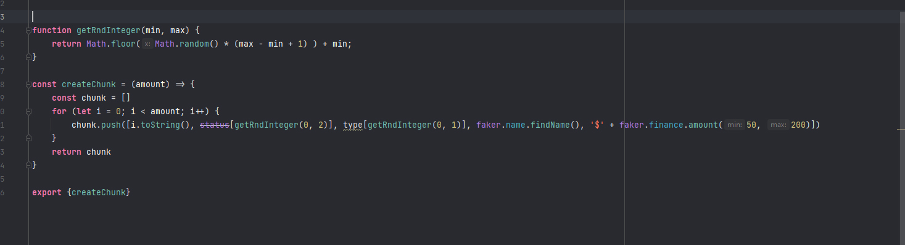
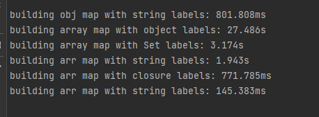
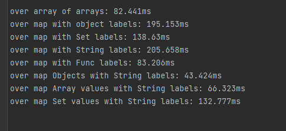

## Realization

This application uses the built-in implementation of hash maps (Map object) that providing necessary functionality.
Small ui tricks like ... in pagination and loaders skipped but have implementation in redux store. It also provides
template for the implementation of the download progress through the adding callback in _buildTransactions.ts_

## Some unnecessary research

Fun fact, javascript objects are also a kind of hash table.

To start. Hash tables do not completely solve the problem of iterating over large amounts of data. Since the application
has sorting by field. In any case, you will need to iterate the array to find the desired fields

So I created a function to generate a large chunk of data and tested different data structures on a 3e6 amount of raw
arrays. Compared the time to create an Map object and sort with different keys and values

Anyway, the implementation in this test case is not well suited for large amounts of data, because sorting, building,
and creating files from data is time-consuming tasks and is best done it in Worker

## Testing

**Creating Map structure**

Well, as expected, the most performant option for creating a new data structure is an array with keys as a string, but
this option is the worst option for changing data in application. I had high expectations from the Set collections, but
they did not come true.

Anyway string id labels with object values have a little slower time and clean data manipulating

**Sorting**

-_-

Iterating over array of arrays have better result. Closures are pretty interesting, but iterating over objects is still
fast enough. And Set keys disappointing me. Set variant similar to objects theoretically should get a better result
close to (O)1 searching for the necessary string, but it doesn't

## Conclusion

Map with object values have better time and static interface for each transaction item. Application uses this
realization